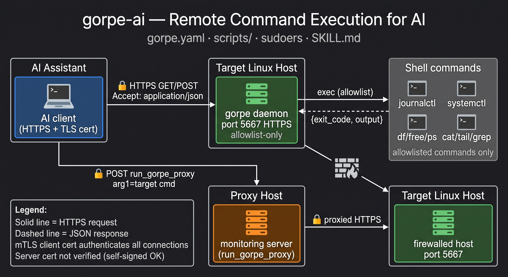

# gorpe-ai

A self-contained bundle for giving an AI assistant remote read/execute access to your Linux fleet via [gorpe](https://github.com/xorpaul/gorpe).

**gorpe** is a lightweight HTTPS daemon that runs allowlisted commands on Linux hosts and returns their output and exit code as JSON. An AI with bash/curl access can call it directly — no intermediate server needed.

This repo ships:

- `gorpe.yaml` — a generic gorpe configuration with ~30 debugging and log-reading commands that work on any systemd-based Linux host (no Nagios plugins required)
- `scripts/` — small bash helper scripts required by the commands in `gorpe.yaml` (path-restricted file readers, compressed log readers, glances wrapper, proxy hop script)
- `sudoers.d/gorpe` — the corresponding sudoers snippet for the `gorpe` user gorpe runs as
- `gorpe.service` — systemd service file for the gorpe daemon
- `SKILL.md` / `AGENTS.md` — AI skill instructions for calling the gorpe HTTP API directly with curl

## Architecture



The gorpe daemon runs allowlisted shell commands and returns `{"exit_code": N, "output": "..."}`. The AI calls it over HTTPS using a TLS client certificate that the daemon trusts. When a target host is not directly reachable, the AI can route through a proxy host using the `run_gorpe_proxy` command.

## What gorpe-ai provides

| Command family | Description |
|---|---|
| `run_df`, `run_df_wild` | Disk usage |
| `run_free`, `run_uptime`, `run_lscpu` | Memory / CPU / load |
| `run_ps` | Process tree (`ps auxf`) |
| `run_glances`, `run_glances_wild` | One-shot resource snapshot (requires glances installed) |
| `run_iostat_wild`, `run_vmstat_wild` | I/O and CPU stats |
| `run_ip_addr`, `run_ip_route`, `run_ip_wild` | Network interface and routing info |
| `run_ss_wild` | Socket and connection list |
| `run_iptables_list`, `run_nft_list` | Firewall rules |
| `run_dmesg` | Kernel ring buffer |
| `run_systemctl_list`, `check_systemctl_status_unit` | systemd unit listing and status |
| `check_journalctl_unit`, `run_journalctl_wild`, `run_journalctl_unit_1h` | Journal log reading |
| `run_cat_wild`, `run_tail_wild`, `run_grep_wild`, `run_awk_wild`, `run_sed_wild` | File reading and text processing |
| `run_zgrep_wild`, `run_ztail_wild`, `run_bzgrep_wild`, `run_bztail_wild` | Compressed log reading |
| `run_ls_wild`, `run_stat_wild` | Directory listing and file metadata |
| `check_w` | Liveness probe (`w`) |
| `run_gorpe_proxy` | Proxy hop through a monitoring server |
| `run_puppet_agent*`, `check_journalctl_puppet*` | Puppet agent control and log reading (optional) |

The `check_*` Nagios plugin family is **not included** — those require monitoring plugins installed on each host. Add them to `gorpe.yaml` if you have a standard Nagios/Icinga setup.

## Quickstart

### 1. Install gorpe on each target host

Download the gorpe binary from https://github.com/xorpaul/gorpe/releases.

```bash
curl -Lo /usr/sbin/gorpe https://github.com/xorpaul/gorpe/releases/download/v2.4.0/gorpe_v2.4.0_linux-amd64
chmod 0755 /usr/sbin/gorpe
```

### 2. Create the gorpe user and directories

```bash
useradd --system --no-create-home --shell /sbin/nologin gorpe
mkdir -p /etc/gorpe/ssl
chown root:gorpe /etc/gorpe /etc/gorpe/ssl
chmod 755 /etc/gorpe 775 /etc/gorpe/ssl
```

### 3. Install the helper scripts

```bash
install -d -m 755 /usr/local/lib/gorpe-ai/scripts
install -m 755 scripts/* /usr/local/lib/gorpe-ai/scripts/
```

### 4. Configure TLS

gorpe generates a self-signed CA and server cert on first run if `certs_dir` is empty:

```bash
# Run once to generate self-signed certs in /etc/gorpe/ssl/
/usr/sbin/gorpe -config /etc/gorpe/gorpe.yaml
# Stop it (Ctrl-C), then copy the generated CA to the machine running curl
```

Alternatively, provide your own CA-signed certs (recommended for production):

```bash
cp your-server-cert.pem /etc/gorpe/ssl/cert.pem
cp your-server-key.pem  /etc/gorpe/ssl/key.pem
cp your-ca.pem          /etc/gorpe/ssl/ca.pem
chown gorpe:gorpe /etc/gorpe/ssl/cert.pem /etc/gorpe/ssl/key.pem /etc/gorpe/ssl/ca.pem
chmod 644 /etc/gorpe/ssl/cert.pem /etc/gorpe/ssl/ca.pem
chmod 640 /etc/gorpe/ssl/key.pem
```

### 5. Install gorpe.yaml and configure allowed IPs

```bash
cp gorpe.yaml /etc/gorpe/gorpe.yaml
```

Edit `/etc/gorpe/gorpe.yaml` and add the IP address(es) of any machine that will be calling gorpe (your AI workstation, monitoring servers, etc.) to `allowed_ips`.

For mTLS (recommended), also set `verify_client_cert: 1` and point `ca_file` at the CA that signed the curl client certificate.

### 6. Install sudoers

```bash
install -m 440 -o root -g root sudoers.d/gorpe /etc/sudoers.d/gorpe
visudo -cf /etc/sudoers.d/gorpe   # validate before using
```

### 7. Install and start the systemd service

```bash
install -m 644 gorpe.service /lib/systemd/system/gorpe.service
systemctl daemon-reload
systemctl enable --now gorpe
systemctl status gorpe
```

### 8. Call gorpe from your AI

Load `SKILL.md` into your AI session. It teaches the AI to call the gorpe API directly with curl:

```bash
# No argument
curl -sk --cert /path/to/client.pem --key /path/to/client.key \
  -H "Accept: application/json" \
  https://target-host:5667/run_df

# With argument
curl -sk --cert /path/to/client.pem --key /path/to/client.key \
  -H "Accept: application/json" \
  -d "arg1=nginx" \
  https://target-host:5667/check_journalctl_unit
```

The `-k` flag skips server cert verification (gorpe daemons may use self-signed certs). Authentication is provided by the client cert.

## Security notes

### TLS without server cert verification

Calls use `-k` / `CERT_NONE` — the gorpe server's certificate is not verified. This is intentional: gorpe daemons may use self-signed certificates, and authentication is provided by mTLS (client certificate signed by a shared CA) rather than by verifying the server cert.

### Allowed IPs

Only IPs listed in `allowed_ips` in `/etc/gorpe/gorpe.yaml` can connect. All other connections are rejected before any command runs.

### Allowlist-only execution

gorpe only runs commands explicitly listed in the `commands:` section of `gorpe.yaml`. Unknown command names are rejected. Shell injection is prevented by gorpe's argument sanitisation.

### sudo scope

The sudoers file grants `gorpe` passwordless sudo for specific commands only. The helper scripts deny `/etc/shadow` and `/etc/gshadow`. `run_sed_wild` blocks `-i` / `--in-place`.

## Proxy hop for firewalled hosts

When a target host is not reachable directly, route through a monitoring server that does have access using `run_gorpe_proxy`:

```bash
curl -sk --cert /path/to/client.pem --key /path/to/client.key \
  -H "Accept: application/json" \
  -d "arg1=firewalled-host.example.com run_df" \
  https://monitoring-server.example.com:5667/run_gorpe_proxy
```

The monitoring server must have `run_gorpe_proxy` in its `gorpe.yaml` `commands:` section and must accept connections from the calling IP in its `allowed_ips`.

## Extending with Nagios checks

To add Nagios-style health checks, install the relevant monitoring plugins and add entries to `gorpe.yaml`:

```yaml
commands:
  check_disk: /usr/lib/nagios/plugins/check_disk -w '$ARG$'% -c '$ARG$'%
  check_disk_wild: /usr/lib/nagios/plugins/check_disk $ARG$
```

gorpe returns the check's exit code (0=OK, 1=WARNING, 2=CRITICAL, 3=UNKNOWN) and output.

## Optional: MCP server

If your AI client supports the Model Context Protocol and you prefer tool-call semantics over raw curl, [gorpe-mcp](https://github.com/xorpaul/gorpe-mcp) wraps the same gorpe HTTP API as `gorpe_run` and `gorpe_run_via_proxy` MCP tools. It is not required — the direct curl approach in `SKILL.md` works with any AI that has shell access.

## Source and upstream

- gorpe daemon: https://github.com/xorpaul/gorpe
- check_gorpe client: https://github.com/xorpaul/check_gorpe
- gorpe-mcp (optional MCP server): https://github.com/xorpaul/gorpe-mcp
